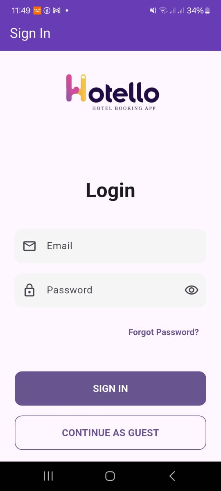
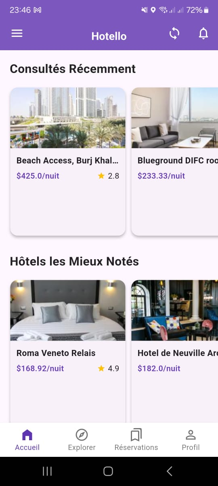
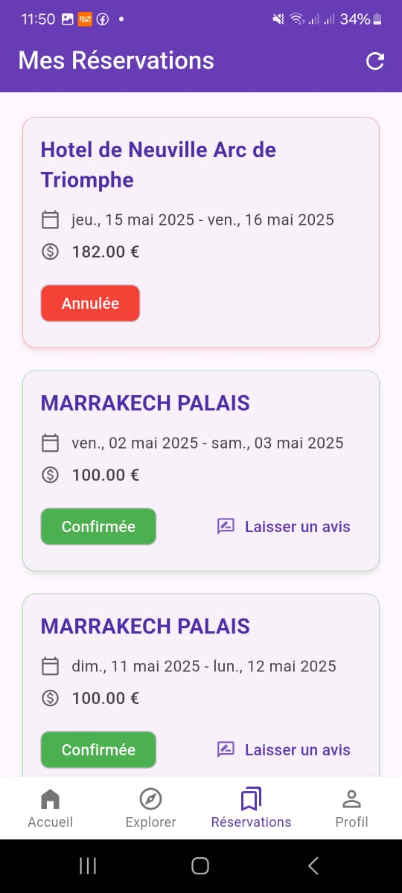
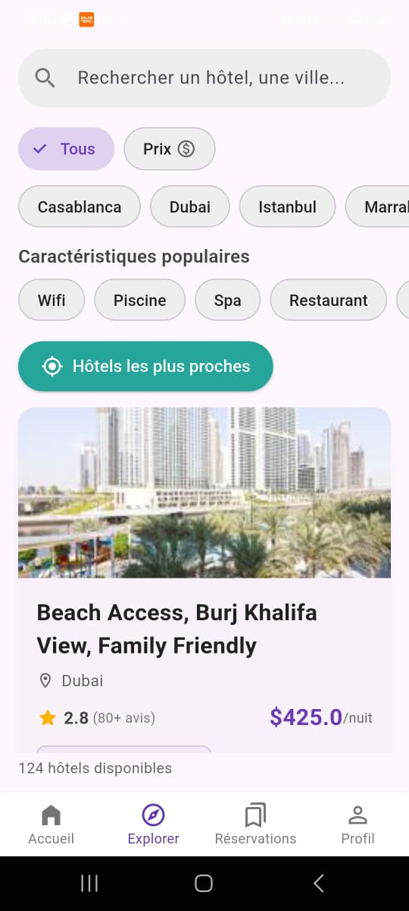
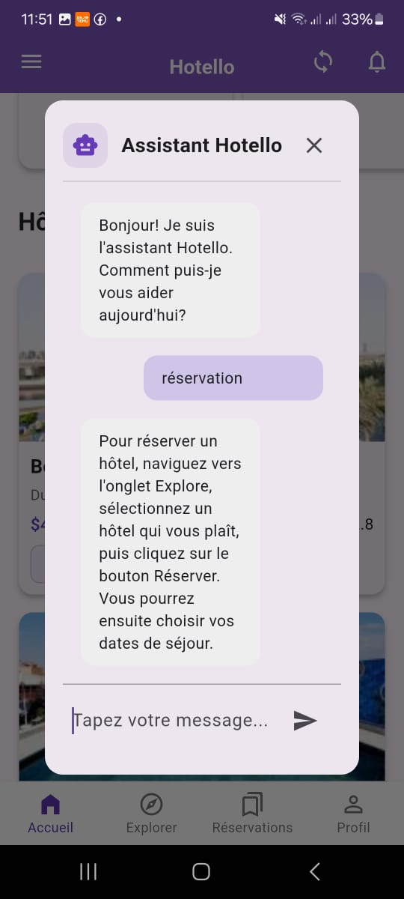
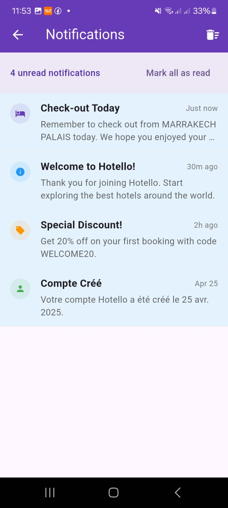

# Hotello - Hotel Booking App


## 📱 About The Project

Hotello is a Flutter application that helps users discover and compare hotels in Marrakech. The application provides detailed information about hotels including ratings, prices, facilities, and distances from city landmarks.
## 🎬 Vidéo de démonstration

<div align="center">
  <a href="assets/screenshot/demo.MP4">
    
  </a>
  <p><i>👆 Cliquez sur l'image pour regarder la démonstration complète de VenteFacile</i></p>
</div>
## 🖼️ Screenshots

<div style="display: flex; justify-content: space-between;">
    
    
    
    
    
    
    
    
</div>


## ✨ Features

- Browse hotels  with detailed information
- View hotel ratings, descriptions, and amenities
- Compare prices and facilities
- Filter hotels based on various criteria
- Interactive map view of hotel locations
- Up-to-date information through data scraping

## 🛠️ Built With

- [Flutter](https://flutter.dev/) - UI toolkit for building natively compiled applications
- [Python](https://www.python.org/) - For data scraping functionality
- [BeautifulSoup4](https://www.crummy.com/software/BeautifulSoup/) - Web scraping library
- [Pandas](https://pandas.pydata.org/) - Data processing and CSV generation

## 🚀 Getting Started

### Prerequisites

- Flutter (latest version)
- Dart SDK
- Python 3.x (for data scraping)
- Android Studio or VS Code

### Installation

1. Clone the repo
   ```sh
   git clone https://github.com/yourusername/hotello.git
   ```
   
2. Install Flutter dependencies
   ```sh
   cd flutter_application_1
   flutter pub get
   ```

3. Install Python dependencies (for data scraping)
   ```sh
   pip install beautifulsoup4 pandas requests
   ```

## 📊 Data Collection

The application uses a Python script (api.py) to scrape hotel data from booking platforms. The script collects:

- Hotel names
- Descriptions
- Review scores
- Textual evaluations
- Prices
- Distances from city center
- Available facilities

Data is stored in a CSV file (`hotels.csv`) which is then accessed by the Flutter application.

To update the hotel data:
```sh
python api.py
```

## 📱 Usage

1. Launch the application
2. Browse the list of available hotels
3. Tap on a hotel to see detailed information
4. Use filters to narrow down your search
5. Compare different hotels side by side

## 🚧 Roadmap

- [ ] Add user authentication
- [ ] Implement booking functionality
- [ ] Add multi-city support
- [ ] Implement favorites system
- [ ] Add dark mode support

## 📄 License

Distributed under the MIT License. See `LICENSE` for more information.

## 📞 Contact

Your Name - [@salaheddine ait el mahjoub] - salaheddineaielmahjoub@gmail.com


## 🙏 Acknowledgments

- [Flutter Documentation](https://docs.flutter.dev/)
- [BeautifulSoup Documentation](https://www.crummy.com/software/BeautifulSoup/bs4/doc/)
